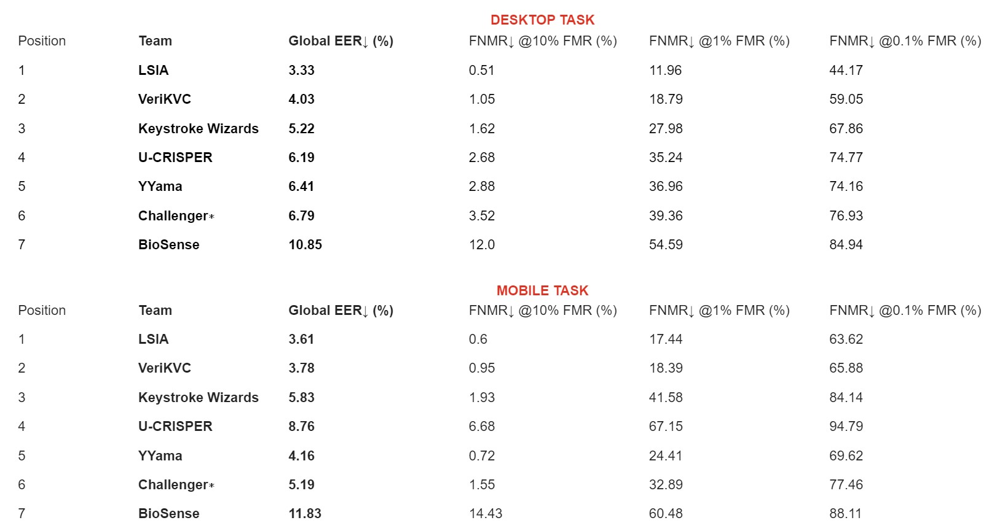
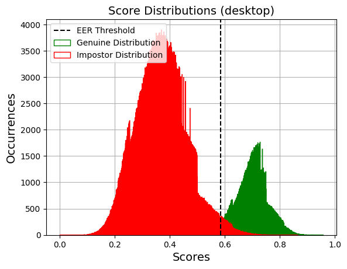

Welcome to the GitHub repository of the **Keystroke Verification Challenge  (KVC) - onGoing**. The challenge provides a public and reproducible way to benchmark keystroke-based user recognition systems in desktop and mobile scenarios, using large-scale databases and a standard experimental protocol.

This ongoing challenge is based on the limited-time KVC organized within IEEE BigData 2023. 

The details and results of the KVC are summarized in the following paper:

- [IEEE BigData 2023](https://ieeexplore.ieee.org/abstract/document/10386557)  ([arXiv version](https://arxiv.org/abs/2401.16559))
- [IEEE Access](https://ieeexplore.ieee.org/abstract/document/10367999) ([arXiv version](https://arxiv.org/abs/2311.06000))

For more information about keystroke dynamics, the databases, and the challenge, please consult the following additional resources:

- [Website](https://sites.google.com/view/bida-kvc/)
- [CodaLab](https://codalab.lisn.upsaclay.fr/competitions/14063)

## Repository Structure

The main files included in this repository are:
- `utils/configs.py` contains configuration settings to run experiments. When launching the first training, a folder called `<configs.experiment_name>/` will be created. As you run the different scripts, a sub-directory structure identical to `pretrained/` will be created.
- `train.py` will launch the training of a simple RNN defined in `models/RNN.py'` with contrastive loss and two features. The training script will select the dataset based on the variable `configs.scenario`  which must be `'desktop'` or `'mobile'`. This script will create the models and the log files. 
- `generate_submission_files.py`: it will run the evaluation and generate the zip file of prediction(s) considering the comparison list(s) included in the downloaded files. Do not change the file names of the text files inside the compressed file (`desktop_predictions.txt`, `mobile_predictions.txt`), but the name of the zip file can be changed. `<configs.experiment_name>.zip` is ready to be submitted to CodaLab for scoring. 
- `read_logs.py` will plot the loss and the EER on both the training and validation sets across the training epochs. 
- `utils/metrics.py` is used to compute the metrics reported below.

## Data Download

First, it is necessary to enroll in the KVC. Please, follow the instructions:

1) Fill up [this form](https://docs.google.com/forms/d/e/1FAIpQLSes7nU7jFtrJV0nwQRaFGt3yUTsFaOKuDycutf2RoVYd4HMYA/viewform) including your information.

2) Sign up in [this form](https://codalab.lisn.upsaclay.fr/competitions/14063) using the same email introduced in step 1).

You are now able to join the KVC-onGoing on CodaLab. 

Then, on the KVC CodaLab page, go to the [Participants tab](https://codalab.lisn.upsaclay.fr/competitions/14063#participate), then click on [Resources for participants](https://codalab.lisn.upsaclay.fr/competitions/14063#participate-get_starting_kit) and download the competition Public Data.

## Leaderboard




## Public Code from Participants

- [Team VeriKVC](https://gitlab.com/vuvko/kvc)
- [Team YYAMA](https://github.com/yamagishi0824/kvc-dualnet)
- [Team BioSense](https://github.com/nask-biometrics/anabel-ka) 

## Citations

If you use any of the parts of this repository, please cite: 

```
@article{bigdata,
  title={{IEEE BigData 2023 Keystroke Verification Challenge (KVC)}},
  author={G. Stragapede, R. Vera-Rodriguez, R. Tolosana \textit{et al.}},
  journal={Proc. IEEE Int. Conf. on Big Data},
  year={2023}
}

@article{stragapede2023kvc,
      title={{Keystroke Verification Challenge (KVC): Biometric and Fairness Benchmark Evaluation}}, 
      author={Giuseppe Stragapede and Ruben Vera-Rodriguez and Ruben Tolosana and Aythami Morales and Naser Damer and Julian Fierrez and Javier Ortega-Garcia},
      year={2023},
      journal = {IEEE Access},
}
```

## Extended Results

Below it is possible to find an example of the format of the results computed by the CodaLab scoring program. The results displayed are achieved by the LSIA Team, that is currently in the first place of the KVC for both tasks (desktop, mobile). 

After submitting your scores, to view the complete results, click on Detailed results on the CodaLab leaderboard. The leaderboard just shows the global EER (%).


Each one of the reported metrics and curves are obtained using the functions that can be found in `utils.metrics`.

Task: desktop<br>Global Distributions<TABLE border="1" style="border: 1px solid #000000; border-collapse: collapse;" cellpadding="4">
 <TR>
  <TD>EER [%]</TD>
  <TD>FNMR @0.1% FMR [%]</TD>
  <TD>FNMR @1% FMR [%]</TD>
  <TD>FNMR @10% FMR [%]</TD>
  <TD>AUC [%]</TD>
  <TD>Accuracy [%]</TD>
 </TR>
 <TR>
  <TD>3.33</TD>
  <TD>44.1673</TD>
  <TD>11.958</TD>
  <TD>0.5071</TD>
  <TD>99.4761</TD>
  <TD>96.676</TD>
 </TR>
</TABLE>Mean Per-Subject Distributions<TABLE border="1" style="border: 1px solid #000000; border-collapse: collapse;" cellpadding="4">
 <TR>
  <TD>EER [%]</TD>
  <TD>AUC [%]</TD>
  <TD>Accuracy [%]</TD>
  <TD>Rank-1 [%]</TD>
 </TR>
 <TR>
  <TD>0.7718</TD>
  <TD>99.8713</TD>
  <TD>96.4278</TD>
  <TD>98.044</TD>
 </TR>
</TABLE>Fairness<TABLE border="1" style="border: 1px solid #000000; border-collapse: collapse;" cellpadding="4">
 <TR>
  <TD>STD [%]</TD>
  <TD>SER</TD>
  <TD>FDR</TD>
  <TD>IR</TD>
  <TD>GARBE</TD>
  <TD>SIR_a [%]</TD>
  <TD>SIR_g [%]</TD>
 </TR>
 <TR>
  <TD>0.6418</TD>
  <TD>1.0249</TD>
  <TD>97.061</TD>
  <TD>2.0791</TD>
  <TD>0.1316</TD>
  <TD>4.0316</TD>
  <TD>3.045</TD>
 </TR>
</TABLE>Global Accuracy by Demographic Group [%]<TABLE border="1" style="border: 1px solid #000000; border-collapse: collapse;" cellpadding="4">
 <TR>
  <TD>&nbsp;</TD>
  <TD>M</TD>
  <TD>F</TD>
  <TD>Mean</TD>
 </TR>
 <TR>
  <TD>10-13</TD>
  <TD>96.6949</TD>
  <TD>95.9447</TD>
  <TD>96.3198</TD>
 </TR>
 <TR>
  <TD>14-17</TD>
  <TD>96.6405</TD>
  <TD>96.2649</TD>
  <TD>96.4527</TD>
 </TR>
 <TR>
  <TD>18-26</TD>
  <TD>96.7689</TD>
  <TD>96.5207</TD>
  <TD>96.6448</TD>
 </TR>
 <TR>
  <TD>27-35</TD>
  <TD>96.5879</TD>
  <TD>96.2198</TD>
  <TD>96.4038</TD>
 </TR>
 <TR>
  <TD>35-44</TD>
  <TD>96.0336</TD>
  <TD>95.7015</TD>
  <TD>95.8676</TD>
 </TR>
 <TR>
  <TD>45-79</TD>
  <TD>96.1689</TD>
  <TD>94.4155</TD>
  <TD>95.2922</TD>
 </TR>
 <TR>
  <TD>Mean</TD>
  <TD>96.44</TD>
  <TD>95.8245</TD>
  <TD>&nbsp;</TD>
 </TR>
</TABLE>Impostor Distances by Age Group<TABLE border="1" style="border: 1px solid #000000; border-collapse: collapse;" cellpadding="4">
 <TR>
  <TD>&nbsp;</TD>
  <TD>10-13</TD>
  <TD>14-17</TD>
  <TD>18-26</TD>
  <TD>27-35</TD>
  <TD>35-44</TD>
  <TD>45-79</TD>
 </TR>
 <TR>
  <TD>10-13</TD>
  <TD>0.4005</TD>
  <TD>0.3793</TD>
  <TD>0.3768</TD>
  <TD>0.371</TD>
  <TD>0.3724</TD>
  <TD>0.3777</TD>
 </TR>
 <TR>
  <TD>14-17</TD>
  <TD>0.3793</TD>
  <TD>0.3899</TD>
  <TD>0.3817</TD>
  <TD>0.3778</TD>
  <TD>0.3785</TD>
  <TD>0.3763</TD>
 </TR>
 <TR>
  <TD>18-26</TD>
  <TD>0.3768</TD>
  <TD>0.3817</TD>
  <TD>0.3816</TD>
  <TD>0.3787</TD>
  <TD>0.3787</TD>
  <TD>0.38</TD>
 </TR>
 <TR>
  <TD>27-35</TD>
  <TD>0.371</TD>
  <TD>0.3778</TD>
  <TD>0.3787</TD>
  <TD>0.3867</TD>
  <TD>0.3841</TD>
  <TD>0.3849</TD>
 </TR>
 <TR>
  <TD>35-44</TD>
  <TD>0.3724</TD>
  <TD>0.3785</TD>
  <TD>0.3787</TD>
  <TD>0.3841</TD>
  <TD>0.3978</TD>
  <TD>0.3962</TD>
 </TR>
 <TR>
  <TD>45-79</TD>
  <TD>0.3777</TD>
  <TD>0.3763</TD>
  <TD>0.38</TD>
  <TD>0.3849</TD>
  <TD>0.3962</TD>
  <TD>0.413</TD>
 </TR>
</TABLE>Impostor Distances by Gender Group<TABLE border="1" style="border: 1px solid #000000; border-collapse: collapse;" cellpadding="4">
 <TR>
  <TD>&nbsp;</TD>
  <TD>M</TD>
  <TD>F</TD>
 </TR>
 <TR>
  <TD>M</TD>
  <TD>0.3866</TD>
  <TD>0.3785</TD>
 </TR>
 <TR>
  <TD>F</TD>
  <TD>0.3785</TD>
  <TD>0.3935</TD>
 </TR>
</TABLE><br><br>Task: mobile<br>Global Distributions<TABLE border="1" style="border: 1px solid #000000; border-collapse: collapse;" cellpadding="4">
 <TR>
  <TD>EER [%]</TD>
  <TD>FNMR @0.1% FMR [%]</TD>
  <TD>FNMR @1% FMR [%]</TD>
  <TD>FNMR @10% FMR [%]</TD>
  <TD>AUC [%]</TD>
  <TD>Accuracy [%]</TD>
 </TR>
 <TR>
  <TD>3.61</TD>
  <TD>63.616</TD>
  <TD>17.4376</TD>
  <TD>0.5992</TD>
  <TD>99.278</TD>
  <TD>96.3872</TD>
 </TR>
</TABLE>Mean Per-Subject Distributions<TABLE border="1" style="border: 1px solid #000000; border-collapse: collapse;" cellpadding="4">
 <TR>
  <TD>EER [%]</TD>
  <TD>AUC [%]</TD>
  <TD>Accuracy [%]</TD>
  <TD>Rank-1 [%]</TD>
 </TR>
 <TR>
  <TD>1.034</TD>
  <TD>99.7594</TD>
  <TD>96.24</TD>
  <TD>96.11</TD>
 </TR>
</TABLE>Fairness<TABLE border="1" style="border: 1px solid #000000; border-collapse: collapse;" cellpadding="4">
 <TR>
  <TD>STD [%]</TD>
  <TD>SER</TD>
  <TD>FDR</TD>
  <TD>IR</TD>
  <TD>GARBE</TD>
  <TD>SIR_a [%]</TD>
  <TD>SIR_g [%]</TD>
 </TR>
 <TR>
  <TD>0.6654</TD>
  <TD>1.0254</TD>
  <TD>94.327</TD>
  <TD>4.0105</TD>
  <TD>0.2137</TD>
  <TD>5.111</TD>
  <TD>4.8338</TD>
 </TR>
</TABLE>Global Accuracy by Demographic Group [%]<TABLE border="1" style="border: 1px solid #000000; border-collapse: collapse;" cellpadding="4">
 <TR>
  <TD>&nbsp;</TD>
  <TD>M</TD>
  <TD>F</TD>
  <TD>Mean</TD>
 </TR>
 <TR>
  <TD>10-13</TD>
  <TD>95.8898</TD>
  <TD>96.0118</TD>
  <TD>95.9508</TD>
 </TR>
 <TR>
  <TD>14-17</TD>
  <TD>96.0405</TD>
  <TD>95.5469</TD>
  <TD>95.7937</TD>
 </TR>
 <TR>
  <TD>18-26</TD>
  <TD>96.433</TD>
  <TD>94.9858</TD>
  <TD>95.7094</TD>
 </TR>
 <TR>
  <TD>27-35</TD>
  <TD>96.4899</TD>
  <TD>96.0603</TD>
  <TD>96.2751</TD>
 </TR>
 <TR>
  <TD>35-44</TD>
  <TD>96.9359</TD>
  <TD>96.2244</TD>
  <TD>96.5802</TD>
 </TR>
 <TR>
  <TD>45-79</TD>
  <TD>97.4024</TD>
  <TD>95.3293</TD>
  <TD>96.3658</TD>
 </TR>
 <TR>
  <TD>Mean</TD>
  <TD>96.6603</TD>
  <TD>95.6293</TD>
  <TD>&nbsp;</TD>
 </TR>
</TABLE>Impostor Distances by Age Group<TABLE border="1" style="border: 1px solid #000000; border-collapse: collapse;" cellpadding="4">
 <TR>
  <TD>&nbsp;</TD>
  <TD>10-13</TD>
  <TD>14-17</TD>
  <TD>18-26</TD>
  <TD>27-35</TD>
  <TD>35-44</TD>
  <TD>45-79</TD>
 </TR>
 <TR>
  <TD>10-13</TD>
  <TD>0.2964</TD>
  <TD>0.2942</TD>
  <TD>0.29</TD>
  <TD>0.2867</TD>
  <TD>0.2809</TD>
  <TD>0.2773</TD>
 </TR>
 <TR>
  <TD>14-17</TD>
  <TD>0.2942</TD>
  <TD>0.3058</TD>
  <TD>0.2967</TD>
  <TD>0.2908</TD>
  <TD>0.2849</TD>
  <TD>0.2735</TD>
 </TR>
 <TR>
  <TD>18-26</TD>
  <TD>0.29</TD>
  <TD>0.2967</TD>
  <TD>0.3183</TD>
  <TD>0.2994</TD>
  <TD>0.2982</TD>
  <TD>0.2923</TD>
 </TR>
 <TR>
  <TD>27-35</TD>
  <TD>0.2867</TD>
  <TD>0.2908</TD>
  <TD>0.2994</TD>
  <TD>0.3015</TD>
  <TD>0.2902</TD>
  <TD>0.2902</TD>
 </TR>
 <TR>
  <TD>35-44</TD>
  <TD>0.2809</TD>
  <TD>0.2849</TD>
  <TD>0.2982</TD>
  <TD>0.2902</TD>
  <TD>0.3017</TD>
  <TD>0.2997</TD>
 </TR>
 <TR>
  <TD>45-79</TD>
  <TD>0.2773</TD>
  <TD>0.2735</TD>
  <TD>0.2923</TD>
  <TD>0.2902</TD>
  <TD>0.2997</TD>
  <TD>0.3031</TD>
 </TR>
</TABLE>Impostor Distances by Gender Group<TABLE border="1" style="border: 1px solid #000000; border-collapse: collapse;" cellpadding="4">
 <TR>
  <TD>&nbsp;</TD>
  <TD>M</TD>
  <TD>F</TD>
 </TR>
 <TR>
  <TD>M</TD>
  <TD>0.2977</TD>
  <TD>0.2936</TD>
 </TR>
 <TR>
  <TD>F</TD>
  <TD>0.2936</TD>
  <TD>0.3179</TD>
 </TR>
</TABLE>





